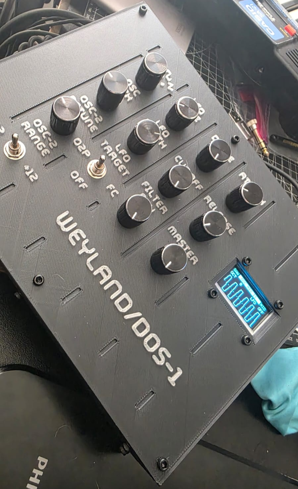

# Weyland DOS-1

  

Weyland DOS-1 is a digital monophonic synthesizer built from scratch around an ESP32-S3.

It features two oscillators, waveform selection, oscillator mix and detune, an AR envelope, a low-pass filter, drive, and an LFO assignable to oscillator 2 pitch or filter cutoff (or off). Audio is generated at 48 kHz and sent through a PCM5102A DAC.

Weyland accepts USB MIDI directly as a device or through an RP2040-based USB host bridge, allowing it to work with class-compliant USB MIDI controllers without a computer.

[Watch it in action here.](https://youtu.be/kIQRiqMi21E)
## Overview

The project includes the synthesizer firmware, USB MIDI host firmware, wiring documentation, component list, and files for the custom 3D-printed enclosure.

Weyland DOS-1 was designed as a complete playable instrument rather than a development board experiment: all user-adjustable synthesis parameters have dedicated physical controls, while the OLED displays the current MIDI source, waveform, oscillator range, LFO assignment, parameter values, and a live scope of the final audio output.

## Features

- Digital monophonic synthesizer running at 48 kHz
- Dual oscillators with shared waveform selection
- Oscillator mix, detune, and octave-range controls
- Low-pass filter with envelope modulation
- Attack–release amplitude envelope
- LFO with adjustable rate and depth
- LFO routing to oscillator 2 pitch, filter cutoff, or off
- Adjustable drive and master output
- Velocity-sensitive MIDI response
- Last-note priority with held-note fallback
- Direct USB MIDI device mode
- USB MIDI host mode through an RP2040 bridge
- OLED status display with live parameter feedback and output waveform scope
- Dedicated physical controls for every synthesis parameter
- PCM5102A I²S audio output
- Custom 3D-printed enclosure

## Architecture

Weyland is built around an ESP32-S3, which runs the synthesis engine, processes the physical controls, receives MIDI, updates the OLED, and sends digital audio to the DAC.

| Component | Function |
| --- | --- |
| ESP32-S3 | Synthesis engine, control processing, MIDI and display |
| RP2040 Pico | USB MIDI host and UART bridge |
| MCP3208 | Eight-channel ADC for the analog controls |
| PCM5102A | 48 kHz I²S digital-to-analog conversion |
| SH1106 OLED | MIDI mode, octave and LFO status display |

MIDI can reach the synthesizer through two paths:

- **Device mode:** A computer or USB host connects directly to the ESP32-S3.
- **Host mode:** A class-compliant USB MIDI controller connects to the RP2040, which forwards the MIDI data to the ESP32-S3 over UART.

## Controls

| Control | Function |
| --- | --- |
| WAVE | Selects the waveform used by both oscillators |
| OSC MIX | Blends oscillator 1 and oscillator 2 |
| OSC-2 DETUNE | Fine-tunes oscillator 2 relative to oscillator 1 |
| OSC -2 RANGE | Shifts oscillator 2 by −12, 0 or +12 semitones |
| LFO RATE | Sets the modulation speed |
| LFO DEPTH | Sets the modulation amount |
| LFO TARGET | Routes the LFO to the filter, oscillator 2 or off |
| DRIVE | Adds saturation to the signal |
| CUTOFF | Sets the low-pass filter cutoff |
| FILTER ENV | Sets the envelope modulation applied to the filter |
| ATTACK | Sets the amplitude-envelope attack time |
| RELEASE | Sets the amplitude-envelope release time |
| MASTER | Sets the output level |

Weyland is monophonic and uses last-note priority. When the current note is released, it returns to the newest note still being held.

## MIDI

Weyland DOS-1 can receive MIDI in two ways:

* **USB device mode:** connect Weyland directly to a computer or DAW.
* **USB host mode:** connect a class-compliant USB MIDI controller through the internal RP2040 Pico bridge.

In host mode, the Pico reads the USB MIDI data and forwards supported messages to the ESP32-S3 using the custom MGP UART protocol. The selected MIDI source is handled exclusively rather than combining both inputs. The display identifies the active source.

### Supported MIDI messages

| MIDI message            | Behaviour                                                  |
| ----------------------- | ---------------------------------------------------------- |
| Note On                 | Plays the received note. Note velocity controls its level. |
| Note Off                | Releases the note, subject to sustain-pedal state.         |
| Note On with velocity 0 | Treated as Note Off.                                       |
| Pitch Bend              | Bends the pitch of the active voice.                       |
| CC 1 — Modulation Wheel | Adds MIDI-controlled modulation.                           |
| CC 64 — Sustain Pedal   | Defers note releases while the pedal is held.              |
| CC 120 — All Sound Off  | Immediately silences the synth.                            |
| CC 123 — All Notes Off  | Clears the held-note state and releases the voice.         |

Weyland listens on all 16 MIDI channels and uses **monophonic last-note priority**. The newest held note becomes active; releasing it returns to the most recently held previous note. The held-note stack also works with sustain-pedal input. The original note-priority and MGP transport behaviour was established in the earlier bridge firmware and retained in the final version.

Channel pressure, polyphonic aftertouch, program changes, MIDI clock, SysEx, and arbitrary MIDI CC control of the front-panel parameters are not currently implemented.

## Hardware

### Core components

| Component | Purpose |
| --- | --- |
| ESP32-S3-WROOM-1 | Main processor and synthesis engine |
| Raspberry Pi Pico / RP2040 | USB MIDI host bridge |
| PCM5102A module | I²S audio output |
| MCP3208 | 12-bit ADC for eight analog controls |
| 1.3-inch SH1106 OLED | Status display |
| Potentiometers and switches | Synth parameter controls |
| Audio output jack | Line-level audio output |
| USB connectors | Power, direct MIDI and USB-host MIDI |
| Custom 3D-printed enclosure | Panel and electronics housing |

## Wiring and Pin Mapping

### ESP32-S3 connections

| GPIO | Connection |
| ---: | --- |
| 1 | MIDI host/device mode selector |
| 4 | Oscillator mix |
| 5 | Oscillator 2 detune |
| 6, 7 | Oscillator 2 octave selector |
| 9, 10 | LFO target selector |
| 11–14 | Waveform selector |
| 15 | UART MIDI input from the RP2040 bridge |
| 16 | OLED SDA |
| 17 | OLED SCL |
| 35 | PCM5102A LRCK |
| 36 | PCM5102A DIN |
| 37 | PCM5102A BCK |
| 39 | MCP3208 CS |
| 40 | MCP3208 MOSI |
| 41 | MCP3208 MISO |
| 42 | MCP3208 SCK |

### MCP3208 channels

| Channel | Control |
| ---: | --- |
| CH0 | LFO rate |
| CH1 | LFO depth |
| CH2 | Drive |
| CH3 | Filter cutoff |
| CH4 | Filter envelope amount |
| CH5 | Attack |
| CH6 | Release |
| CH7 | Master output |

The supplied firmware compensates for the potentiometer orientation used in the original build. If the controls operate backwards in another build, swap the outer potentiometer connections or change the inversion behavior in the firmware.

## Firmware Setup

Weyland uses two separate firmware sketches:

* The **ESP32-S3 firmware** runs the synthesizer, display, controls, direct USB MIDI and MGP receiver.
* The **RP2040 firmware** acts as a USB MIDI host and forwards MIDI to the ESP32-S3.

### Requirements

* Arduino IDE
* **esp32** board package by Espressif Systems
* **Raspberry Pi Pico/RP2040** board package by Earle F. Philhower III
* Adafruit GFX Library
* Adafruit SH110X Library

TinyUSB host support is included with the RP2040 board package.

### ESP32-S3 firmware

The main synthesizer firmware consists of three files:

* `Weyland_v0_28e.ino`
* `WeylandDisplay.cpp`
* `WeylandDisplay.h`

Keep all three files inside the same Arduino sketch folder.

Use these Arduino IDE settings:

| Setting         | Value              |
| --------------- | ------------------ |
| Board           | ESP32S3 Dev Module |
| USB CDC On Boot | Disabled           |
| USB Mode        | USB-OTG (TinyUSB)  |

Compile and upload the sketch to the ESP32-S3.

In DEVICE mode, the ESP32-S3 appears as a USB MIDI device named **Weyland DOS-1**.

The OLED uses I²C address `0x3C`. If the display is missing or fails to initialize, the synthesizer will continue operating without it.

### RP2040 USB host firmware

The USB MIDI host bridge uses:

* `Weyland_Pico_USBHost_HardwareReset_v0_5.ino`

Place this file in its own Arduino sketch folder.

Use these Arduino IDE settings:

| Setting   | Value                                           |
| --------- | ----------------------------------------------- |
| Board     | Raspberry Pi Pico, or the matching RP2040 board |
| USB Stack | Adafruit TinyUSB Host (native)                  |

Before uploading, place Weyland’s MIDI source switch in **HOST** mode. In DEVICE mode, the hardware reset circuit holds the Pico in reset.

Because the Pico’s USB port runs as a host instead of a serial device, reflashing may require manually entering BOOTSEL mode:

1. Disconnect the Pico from USB.
2. Hold the **BOOTSEL** button.
3. Reconnect USB and release BOOTSEL.
4. Upload the sketch from Arduino IDE.

### ESP32-S3 and Pico connection

The Pico communicates with the ESP32-S3 using the MGP(1) protocol over UART:

| Pico          | ESP32-S3                                 |
| ------------- | ---------------------------------------- |
| GP0 / UART TX | GPIO15 / UART RX through a 1 kΩ resistor |
| GND           | GND                                      |

The UART connection runs at `115200` baud.

In HOST mode, the Pico receives MIDI from a class-compliant USB MIDI controller and forwards note, sustain, modulation and pitch-bend messages to the ESP32-S3. In DEVICE mode, the Pico is held in reset and the ESP32-S3 accepts MIDI through its own USB connection.

The Pico firmware uses GP25 for its status LED. Boards with a NeoPixel or a differently wired LED will still operate as MIDI bridges, but their status indicator may not work without changing `LED_PIN`.

(1) MGP: Midi Gremlin Protocol. Weyland’s lightweight custom serial protocol. It packages USB MIDI events into fixed UART messages sent from the RP2040 host bridge to the ESP32-S3.

## MIDI Source Selection

Weyland supports two mutually exclusive MIDI input paths, selected with the physical HOST/DEVICE switch.

| Mode | MIDI source | Behavior |
| --- | --- | --- |
| DEVICE | ESP32-S3 USB port | Weyland appears as a USB MIDI device named **Weyland DOS-1** |
| HOST | RP2040 USB port | A class-compliant USB MIDI controller connects directly to Weyland |

In HOST mode, the RP2040 converts incoming USB MIDI events into MGP messages and forwards them to the ESP32-S3 over UART.

In DEVICE mode, the RP2040 is held in reset by the hardware reset circuit, preventing both MIDI paths from operating simultaneously.

## Enclosure and 3D-Printing Files

The repository includes the files for Weyland’s custom 3D-printed enclosure.

I designed the enclosure in Autodesk Fusion around the specific boards, modules, controls and connectors used in the original build. Components with different dimensions may require modifications to the model.

Before final assembly, test-fit the OLED, potentiometers, switches, USB connectors and audio jack.

### BOM

Exact MCUs I used:

ESP32-S3 N16R8: https://aliexpress.com/item/1005007319706057.html

Raspberry Pi Pico 16MB: https://aliexpress.com/item/1005005617180169.html

I might update the full BOM sometime, but for now this and the provided schematics should be enough to start.
